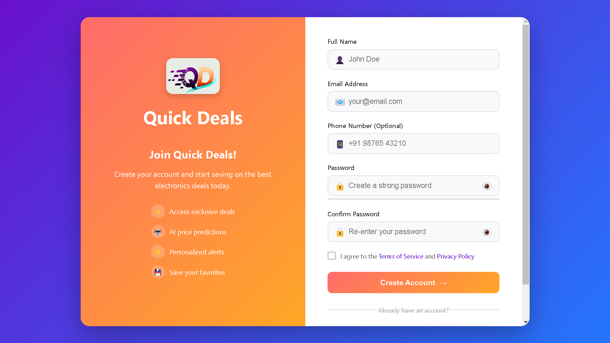
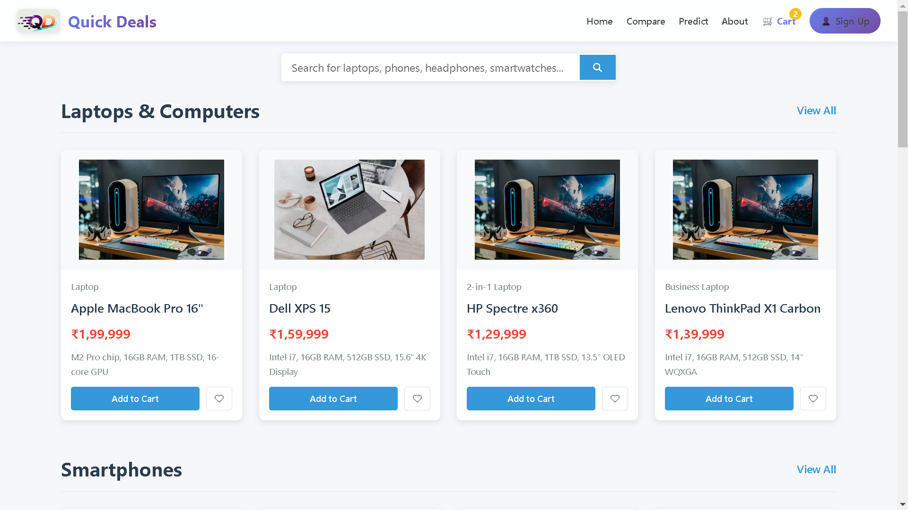
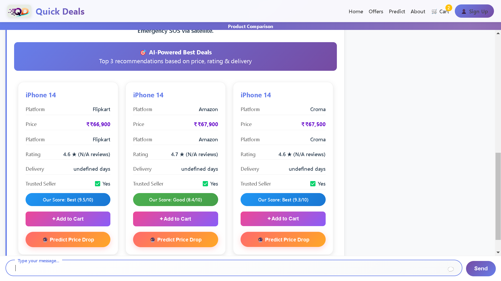
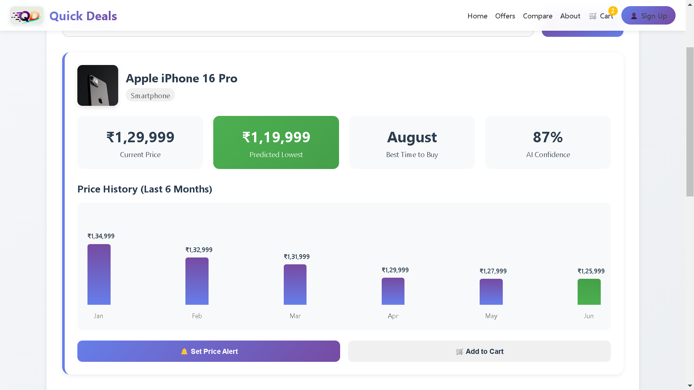
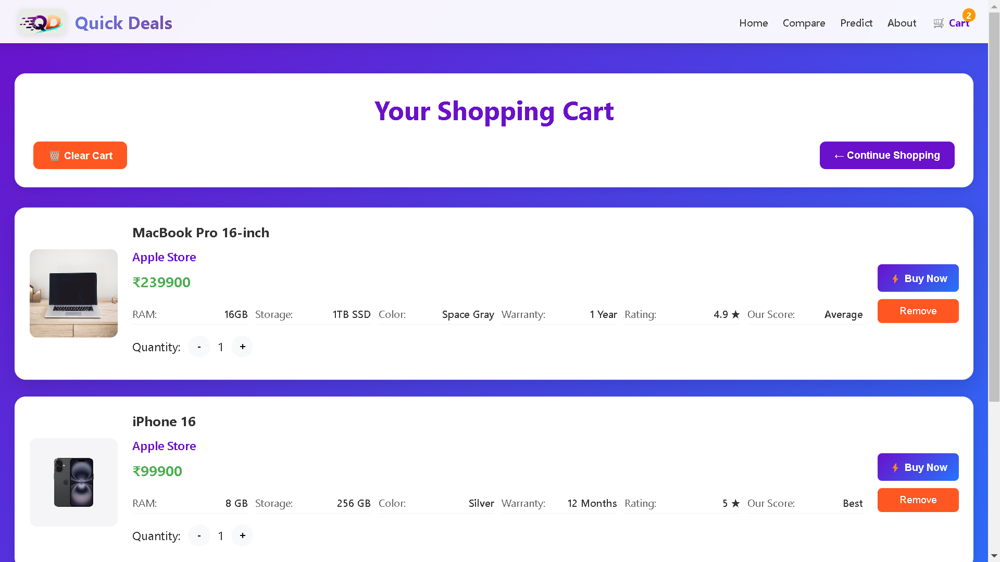

🛒 QuickDeals AI – Smart Shopping Assistant

QuickDeals AI is an AI-powered smart shopping assistant that helps users find the best deals across multiple sellers using machine learning (XGBoost ranking) and intelligent product comparison.
It combines FastAPI backend, HTML/CSS/JS frontend, and JSON-based product datasets to deliver real-time deal recommendations.
📸 Application Screenshots & Page Features

This section provides a visual walkthrough of the QuickDeals AI Smart Shopping Assistant so users can quickly understand the workflow and capabilities of the system.

🔐 Login Page – index.html

Purpose:
First entry point for users to securely access the platform.

Key Features:

Email validation (@ required)

Password validation (minimum 8 characters)

“Remember Me” option

Forgot password & Sign Up links

Redirects to Dashboard after successful login

📷 Screenshot:

📝 Registration Page – register.html

Purpose:
Allows new users to create an account.

Key Features:

Full name, email, password & confirm password

Password strength indicator

Terms & conditions acceptance

Redirects to login page after successful registration

📷 Screenshot:

🏠 Home / Dashboard – home.html

Purpose:
Main dashboard after login where users explore products.

Key Features:

Category-wise product listing

Search bar for quick product lookup

Featured deals section

Navigation menu (Profile, Cart, Logout)

Dynamic loading from products.json

📷 Screenshot:

🔍 AI Product Comparison – compare.html

Purpose:
Core intelligence of the system – AI-based deal comparison.

Key Features:

Chat-based product search

Fuzzy product name matching

Top-3 seller deal recommendations

XGBoost ranking model for best deal selection

Seller trust score, rating, price & specs comparison

📷 Screenshot:

📈 Price Prediction – predict.html

Purpose:
Helps users analyze price trends and future estimates.

Key Features:

Historical price visualization

ML-based price trend insights

Market analysis support for smarter buying decisions

📷 Screenshot:

screenshots/predict.png

🛒 Shopping Cart – cart.html

Purpose:
Manages selected products before checkout.

Key Features:

View added products

Increase/decrease quantity

Automatic price calculation

Simple and clean cart interface

📷 Screenshot:

🔄 User Flow Overview
Login / Register
        ↓
Dashboard (Home)
        ↓
Product Search / Categories
        ↓
AI Comparison (Top Deals)
        ↓
Add to Cart
        ↓
Checkout (Future Scope)

🌐 Live Demo

🔗 Live Website:

https://quick-delas-ai-powerd-smart-shopping.onrender.com/

🚀 Features

🔐 User Authentication

Login & Registration pages

Client-side validation (email & password)

🤖 AI-Powered Deal Ranking

Extreme Gradient Boosting (XGBoost) ranking model

Ranks sellers based on price, rating, delivery time, trust score

💬 Chat-Based Product Search

Search products using natural text

Fuzzy product matching

📊 Top-3 Deal Recommendation

Intelligent seller comparison

Best value prediction

🛍️ Product Categories

Phones

Laptops

Headphones

Smartwatches

🛒 Shopping Cart

📈 Price Prediction Page

📦 JSON-Based Product Dataset

⚡ FastAPI Backend

🎨 Responsive UI (HTML + CSS + JS)

🧠 System Architecture
Frontend (HTML, CSS, JS)
        |
        | REST API
        ↓
FastAPI Backend
        |
        | JSON Dataset
        | XGBoost Ranking Model
        ↓
AI Deal Prediction Engine

📂 Project Structure

QuickDeals-AI/
│
├── app.py                         # FastAPI backend
├── xgb_ranking_pipeline.joblib    # Trained XGBoost model
│
├── data/
│   └── products.json              # Product & seller dataset
│
├── templates/
│   ├── index.html                 # Login page
│   ├── register.html              # Sign-up page
│   ├── home.html                  # Dashboard
│   ├── compare.html               # AI comparison page
│   ├── predict.html               # Price prediction
│   └── cart.html                  # Shopping cart
│
├── static/
│   ├── css/
│   ├── js/
│   └── image/
│
└── README.md
